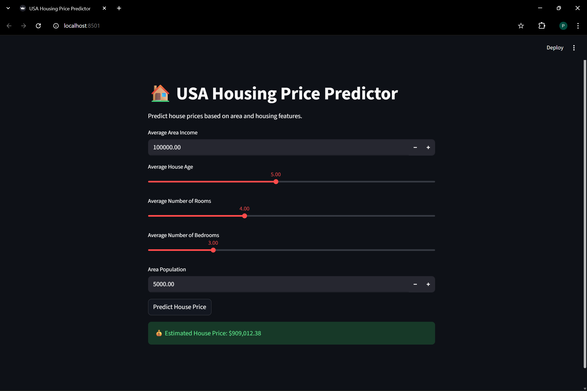

# 🏠 USA Housing Price Prediction Using Python & Machine Learning

## 🚀 Live Demo
🔗 **Streamlit App**:  
https://usa-housing-price-predictor.streamlit.app/

## 📸 App Preview

## 📌 Overview
This project predicts **house prices in the USA** using a **Linear Regression** machine learning model.  
The model is trained on real housing data and deployed as an **interactive Streamlit web application**, where users can input housing features and instantly get a price prediction.

## 🧠 Machine Learning Model
- **Algorithm**: Linear Regression
- **Library**: scikit-learn
- **Model File**: `house_price_model.pkl`
- **Training Environment**: Jupyter Notebook (local)
- **Inference**: Streamlit web app

## 📊 Dataset
- **File**: `USA_Housing.csv`
- **Records**: 5000
- **Features Used**:
  - Average Area Income
  - Average House Age
  - Average Number of Rooms
  - Average Number of Bedrooms
  - Area Population
- **Target Variable**:
  - House Price

## 🖥️ Streamlit Web App Features
- User-friendly UI
- Real-time predictions
- Numeric inputs & sliders
- Clean layout for non-technical users

### Inputs:
- Average Area Income
- Average House Age
- Average Number of Rooms
- Average Number of Bedrooms
- Area Population

### Output:
- 💰 **Estimated House Price**

## 🛠️ Tech Stack

- **Programming Language**: Python  
- **Data Analysis & Visualization**: NumPy, Pandas, Matplotlib, Seaborn  
- **Machine Learning**: scikit-learn (Linear Regression)  
- **Model Serialization**: joblib  
- **Web Framework**: Streamlit  
- **Deployment**: Streamlit Cloud  
- **Version Control**: Git & GitHub  
- **Development Tools**: Jupyter Notebook, VS Code  

## ✅ Conclusion
This project demonstrates a complete **end-to-end machine learning workflow**, from data analysis and model training to real-world deployment using **Streamlit**.  
The linear regression model shows strong predictive performance for estimating house prices based on key socioeconomic and housing features.

By converting the trained model into an interactive web application, the project highlights how machine learning solutions can be made accessible to non-technical users.  
Overall, this project reflects practical skills in **Python, data analysis, machine learning, model deployment, and version control**, making it a solid real-world ML application.
